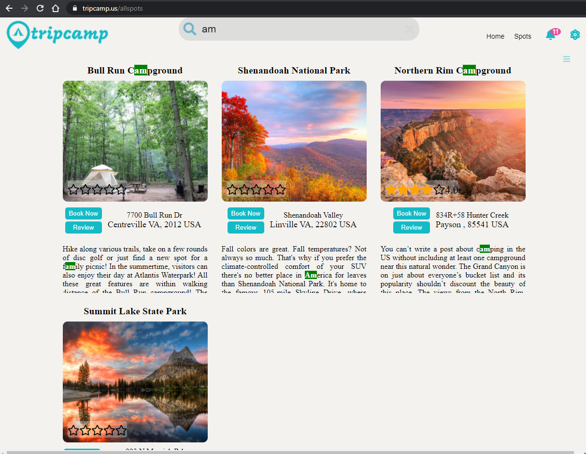
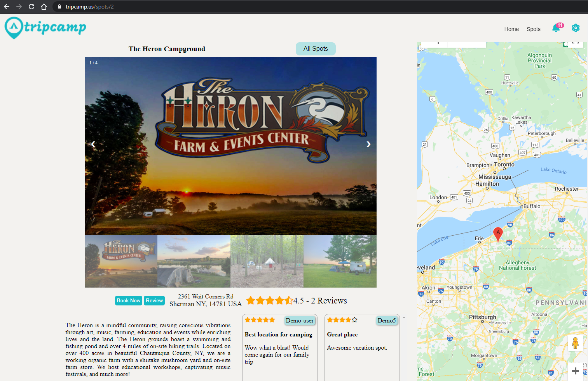
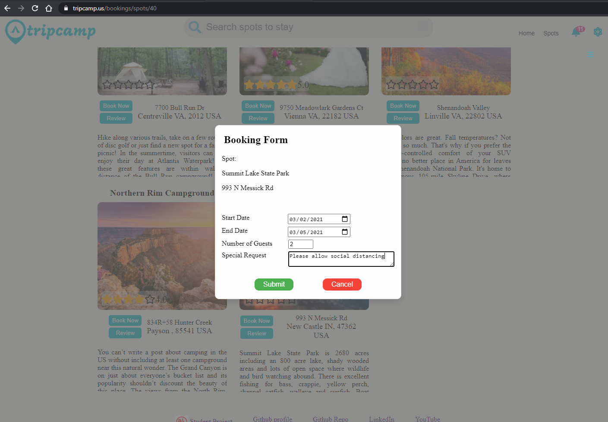
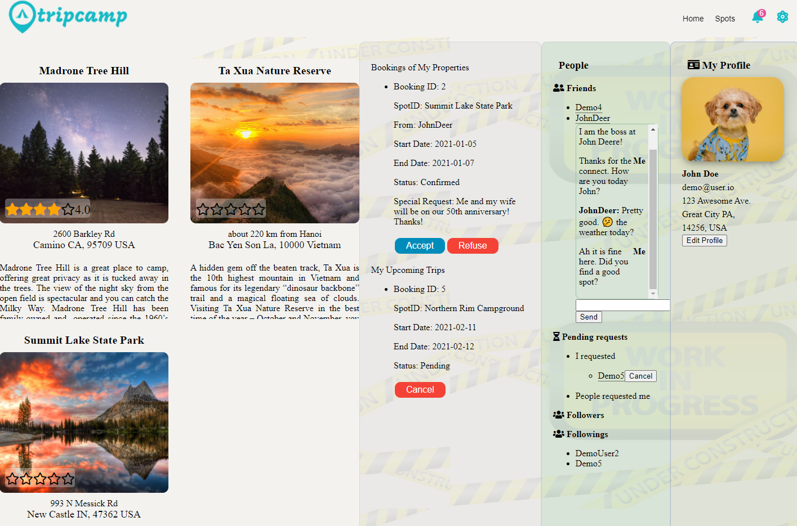

[![Forks][forks-shield]][forks-url]
[![Stargazers][stars-shield]][stars-url]
[![Issues][issues-shield]][issues-url]
[![MIT License][license-shield]][license-url]
[![LinkedIn][linkedin-shield]][linkedin-url]
<!--ReactSkipperStart -->
<br />
<p align="center"  style='margin-top: -40px; margin-bottom: -10px;'>
  <a href="https://github.com/suasllc/tripcamp-react-express-project">
    
  </a>

  <p align="center">
    <b>TripCamp</b> <a href="https://www.tripcamp.us/" target="_blank">https://www.tripcamp.us</a> - A Full-Stack Web Application for camping and glamping site bookings.
    <br />
    <br />
    <a href="https://github.com/suasllc/tripcamp-react-express-project/wiki"><strong>Explore the docs »</strong></a>
    <br />
    <br />
    <a href="https://www.tripcamp.us/" target="_blank">View Demo/Live</a>
    ·
    <a href="https://github.com/suasllc/tripcamp-react-express-project/issues">Report Bug</a>
    ·
    <a href="https://github.com/suasllc/tripcamp-react-express-project/issues">Request Feature</a>
  </p>
</p>


<details open='open'>
   <summary>Table of Contents</summary>
   <ol style='margin: 0px 30px 0px 0px'>
      <li>
         <a href="#about-the-project">About The Project</a>
         <ul>
            <li><a href="#what-is-the-project-about">What is the project about</a></li>
            <li><a href="#most-notable-technologies-used">Technologies</a></li>
            <li><a href="#list-of-mvps">List of MVPs</a></li>
            <li><a href="#database-schema">Database Schema</a></li>
         </ul>
      </li>
      <li>
         <a href="#getting-started">Getting Started</a>
         <ul>
         <li><a href="#prerequisites">Prerequisites</a></li>
         <li><a href="#installation">Installation</a></li>
         </ul>
      </li>
      <li><a href="#usage">Usage</a>
         <ul>
            <li><a href="#more-screenshots">More Screenshots</a></li>
         </ul>
      </li>
      <li><a href="#roadmap">Roadmap</a></li>
      <li><a href="#contributing">Contributing</a></li>
      <li><a href="#license">License</a></li>
      <li><a href="#contact">Contact</a></li>
      <li><a href="#acknowledgements">Acknowledgements</a></li>
   </ol>
</details>


## About The Project
### What is the project about
To a normal non-technical everyday user, this is a website to host camping sites, accommodations (homestay) or any beautiful getaway locations anywhere. This work is originally intended as an App Academy personal student work. The source original websites to clone and get inspired from are: Hipcamp and AirBnB.

To a technical person, this is a full-stack application that serves and presents a dynamic frontend website using React/Redux to the normal users, from an express Node.JS backend server referencing a database of objects like users, spots, reviews... through sequelize and PostgreSQL...

This is my <a href='www.appacademy.io' target='_blank'>App Academy</a> solo project
<!--ReactSkipperEnd -->

<!--ReactSkipperStart -->
<details open="open">
   <summary>Screenshots: Homepage </summary>
   <div style="display: flex">
      
      
   <div>
</details>
<details open="open">
   <summary>Code snippets</summary>
   <div style="display: flex">
      
      
   <div>
</details>

<!--ReactSkipperEnd -->

### Most notable Technologies used
    1. Node.JS, Express
    2. PostgreSQL, Sequelize
    3. React/Redux/JSX (Javascript Extension)
    
### List of MVPs
  1. Spots
  2. Bookings
  3. Spots search (by location & availability) & Google Maps on search
  4. Reviews
  5. Bonus: Messaging
  6. Bonus: user/host profiles

### Database Schema
My database schema is as in the image. The core feature is in the middle, with extra (bonus) features on the periphery.


## Getting Started

To get a local copy up and running follow these steps.

### Prerequisites

Install npm on your local computer
* npm
  ```sh
  npm install npm@latest -g
  ```

### Installation
1. Clone this repository (only this branch)

   ```bash
   git clone https://github.com/suasllc/tripcamp-react-express-project.git
   ```

2. Install dependencies

      ```bash
      npm install
      ```

3. [Further steps here](https://github.com/suasllc/tripcamp-react-express-project/wiki)

## Usage
<!--ReactSkipperStart -->
### More Screenshots

<details open="open">
   <summary>Spots</summary>   
   <div style="display: flex">
      
               
   <div>
</details>
<details open="open">
   <summary>Booking</summary>   
   <div style="display: flex">
      <!-- <div style='display: flex; flex-direction: column; width="40%"'> -->
         
         
      <!-- </div> -->
   <div>
</details>

<!--ReactSkipperEnd -->

_For more examples, please refer to the [Documentation](https://github.com/suasllc/tripcamp-react-express-project/wiki)_


## Roadmap

See the [open issues](https://github.com/suasllc/tripcamp-react-express-project/issues) for a list of proposed features (and known issues).


## Contributing

Contributions are what make the open source community such an amazing place to be learn, inspire, and create. Any contributions you make are **greatly appreciated**.

1. Fork the Project
2. Create your Feature Branch (`git checkout -b feature/AmazingFeature`)
3. Commit your Changes (`git commit -m 'Add some AmazingFeature'`)
4. Push to the Branch (`git push origin feature/AmazingFeature`)
5. Open a Pull Request


## License

Distributed under the MIT License. See `LICENSE` for more information.


## Contact

Tony Ngo [@suas_com](https://twitter.com/suas_com) - website: https://tonyngo.me

Project Link: [https://github.com/suasllc/tripcamp-react-express-project](https://github.com/suasllc/tripcamp-react-express-project)


## Acknowledgements

* [App Academy](https://www.appacademy.io/)
* [Best-README-Template](https://github.com/othneildrew/Best-README-Template)


[contributors-shield]: https://img.shields.io/github/contributors/suasllc/tripcamp-react-express-project.svg?style=for-the-badge
[contributors-url]: https://github.com/suasllc/tripcamp-react-express-project/graphs/contributors
[forks-shield]: https://img.shields.io/github/forks/suasllc/tripcamp-react-express-project.svg?style=for-the-badge
[forks-url]: https://github.com/suasllc/tripcamp-react-express-project/network/members
[stars-shield]: https://img.shields.io/github/stars/suasllc/tripcamp-react-express-project.svg?style=for-the-badge
[stars-url]: https://github.com/suasllc/tripcamp-react-express-project/stargazers
[issues-shield]: https://img.shields.io/github/issues/suasllc/tripcamp-react-express-project.svg?style=for-the-badge
[issues-url]: https://github.com/suasllc/tripcamp-react-express-project/issues
[license-shield]: https://img.shields.io/github/license/suasllc/tripcamp-react-express-project.svg?style=for-the-badge
[license-url]: https://github.com/suasllc/tripcamp-react-express-project/blob/master/LICENSE.txt
[linkedin-shield]: https://img.shields.io/badge/-LinkedIn-black.svg?style=for-the-badge&logo=linkedin&colorB=555
[linkedin-url]: https://www.linkedin.com/in/tony-ngo-suas/

